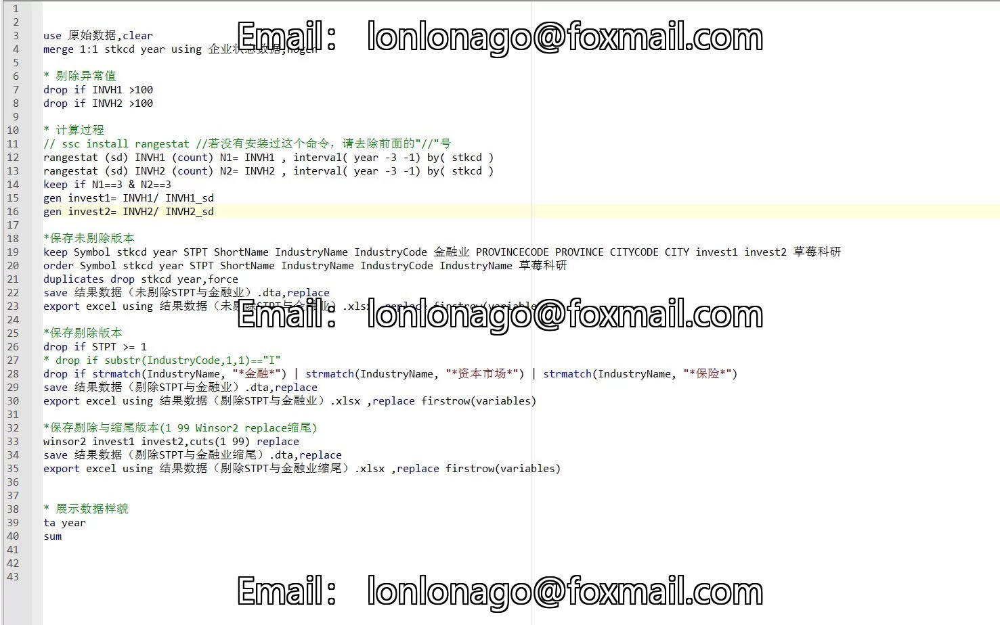
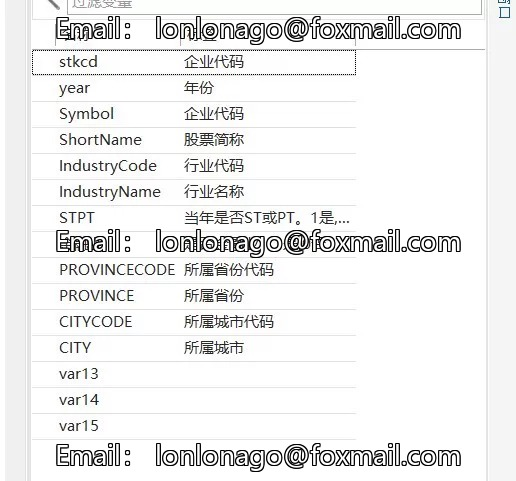
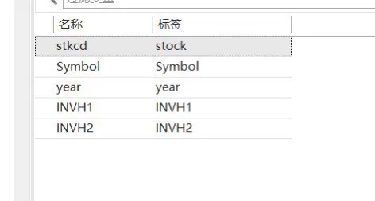
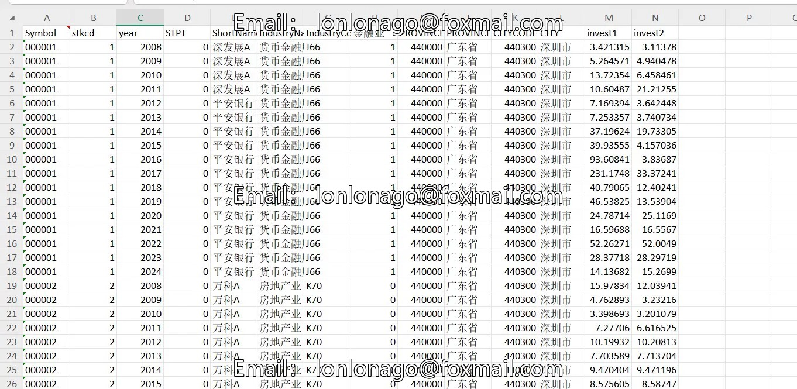

## Body

2008-2024 Corporate Patience Capital Data

PS. Only stable, two measurement methods!

I. Data Introduction
Data Name: Corporate Patience Capital
Data Range: 2008-2024
Data Range: Listed Companies
Data Format: Panel data, results in Excel, original data in DTA, including calculation codes
Sample Size: Over 4800+ companies, 44,700+ samples
References: Wu Minjia, Zhang Pu, Zhao Zengyao. The Influence of Patience Capital and Innovation Investment on Corporate Performance - Based on the Data of Small and Medium-sized Board Listed Enterprises [J]. Scientific Decision Making, 2022, (09):55-72.

II. Data Indicators as Shown in the Figure
The main indicators are:
Invest1: The proportion of institutional investors' holdings to total shares
Invest2: The proportion of institutional investors' holdings to circulating shares

III. Estimation Method
Referencing the method explained by Professor Wu Minjia (2022) in "Scientific Decision Making", this paper measures variables as the proportion of patience capital. This paper will measure from two perspectives: one is the ratio variable of relational debt, which involves research methods about relational debt. All bank loans are considered as relational debt. Banks that lend to enterprises are actually a loan group led by banks, representing all small and medium-sized lenders to monitor borrowing enterprises in fact. Considering the long-term nature of relational debt, the proportion of relational debt is considered as the proportion of all long-term loans to total debt (that is: the proportion of relational debt = Long-term loan total / (Bank loans + Payable bonds + Payable bills). The other is the evaluation of stable equity indicators, considering the significant differences between the actual situation of American institutional investors and China. Therefore, this paper first selects data for institutions with strong risk-bearing capacity, based on the research methods of Niu Jianbo et al. (2013) [7] and Li Zheng et al. (2014) [19], using the overall shareholding ratio of institutional investors (INVH) to measure the overall level of institutional investors' shareholding. And according to this, calculate the stability indicator of institutional investors (Invest), that is, the ratio of company i's investor shareholding ratio in year t to its standard deviation over the past three years. The larger the Investi,t, the higher the stability of institutional investors over time dimension!

## Images

Here is a pay link on Stripe ( https://buy.stripe.com/3cs8yP7sY87d0vu9AB ). Please contact me lonlonago@foxmail.com after funding $89, and I will send you a complete data files , thank you!

